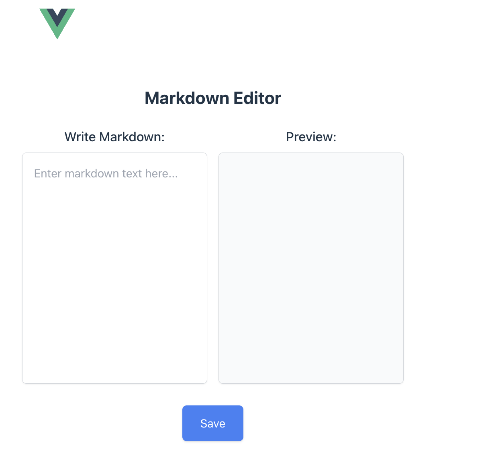

# Markdown Editor using Vue 3 + Vite

This is based on template should help get you started developing with Vue 3 in Vite. 

# Addtional notes

The template uses Vue 3 `<script setup>` SFCs, check out the [script setup docs](https://v3.vuejs.org/api/sfc-script-setup.html#sfc-script-setup) to learn more.

Learn more about IDE Support for Vue in the [Vue Docs Scaling up Guide](https://vuejs.org/guide/scaling-up/tooling.html#ide-support).

I did not use typescript because it is just a one-off script. Feel free to convert to typescript using <a href="https://github.com/mustafadalga/file-extension-converter">this link</a> that I found on the internet.

## Screenshot

